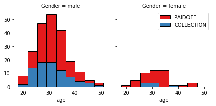
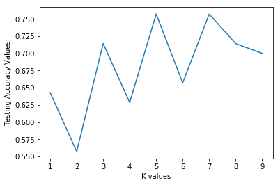

<a href="https://www.bigdatauniversity.com"></a>

<h1 align="center"><font size="5">Classification with Python</font></h1>

In this notebook we try to practice all the classification algorithms that we learned in this course.

We load a dataset using Pandas library, and apply the following algorithms, and find the best one for this specific dataset by accuracy evaluation methods.

Lets first load required libraries:


```python
import itertools
import numpy as np
import matplotlib.pyplot as plt
from matplotlib.ticker import NullFormatter
import pandas as pd
import numpy as np
import matplotlib.ticker as ticker
from sklearn import preprocessing
%matplotlib inline
```

### About dataset

This dataset is about past loans. The __Loan_train.csv__ data set includes details of 346 customers whose loan are already paid off or defaulted. It includes following fields:

| Field          | Description                                                                           |
|----------------|---------------------------------------------------------------------------------------|
| Loan_status    | Whether a loan is paid off on in collection                                           |
| Principal      | Basic principal loan amount at the                                                    |
| Terms          | Origination terms which can be weekly (7 days), biweekly, and monthly payoff schedule |
| Effective_date | When the loan got originated and took effects                                         |
| Due_date       | Since it’s one-time payoff schedule, each loan has one single due date                |
| Age            | Age of applicant                                                                      |
| Education      | Education of applicant                                                                |
| Gender         | The gender of applicant                                                               |

Lets download the dataset


```python
!wget -O loan_train.csv https://s3-api.us-geo.objectstorage.softlayer.net/cf-courses-data/CognitiveClass/ML0101ENv3/labs/loan_train.csv
```

    --2020-07-14 14:49:10--  https://s3-api.us-geo.objectstorage.softlayer.net/cf-courses-data/CognitiveClass/ML0101ENv3/labs/loan_train.csv
    Resolving s3-api.us-geo.objectstorage.softlayer.net (s3-api.us-geo.objectstorage.softlayer.net)... 67.228.254.196
    Connecting to s3-api.us-geo.objectstorage.softlayer.net (s3-api.us-geo.objectstorage.softlayer.net)|67.228.254.196|:443... connected.
    HTTP request sent, awaiting response... 200 OK
    Length: 23101 (23K) [text/csv]
    Saving to: ‘loan_train.csv’
    
    100%[======================================>] 23,101      --.-K/s   in 0.07s   
    
    2020-07-14 14:49:10 (304 KB/s) - ‘loan_train.csv’ saved [23101/23101]
    


### Load Data From CSV File  


```python
df = pd.read_csv('loan_train.csv')
df.head()
```


<div>
<style scoped>
    .dataframe tbody tr th:only-of-type {
        vertical-align: middle;
    }

    .dataframe tbody tr th {
        vertical-align: top;
    }

    .dataframe thead th {
        text-align: right;
    }
</style>
<table border="1" class="dataframe">
  <thead>
    <tr style="text-align: right;">
      <th></th>
      <th>Unnamed: 0</th>
      <th>Unnamed: 0.1</th>
      <th>loan_status</th>
      <th>Principal</th>
      <th>terms</th>
      <th>effective_date</th>
      <th>due_date</th>
      <th>age</th>
      <th>education</th>
      <th>Gender</th>
    </tr>
  </thead>
  <tbody>
    <tr>
      <th>0</th>
      <td>0</td>
      <td>0</td>
      <td>PAIDOFF</td>
      <td>1000</td>
      <td>30</td>
      <td>9/8/2016</td>
      <td>10/7/2016</td>
      <td>45</td>
      <td>High School or Below</td>
      <td>male</td>
    </tr>
    <tr>
      <th>1</th>
      <td>2</td>
      <td>2</td>
      <td>PAIDOFF</td>
      <td>1000</td>
      <td>30</td>
      <td>9/8/2016</td>
      <td>10/7/2016</td>
      <td>33</td>
      <td>Bechalor</td>
      <td>female</td>
    </tr>
    <tr>
      <th>2</th>
      <td>3</td>
      <td>3</td>
      <td>PAIDOFF</td>
      <td>1000</td>
      <td>15</td>
      <td>9/8/2016</td>
      <td>9/22/2016</td>
      <td>27</td>
      <td>college</td>
      <td>male</td>
    </tr>
    <tr>
      <th>3</th>
      <td>4</td>
      <td>4</td>
      <td>PAIDOFF</td>
      <td>1000</td>
      <td>30</td>
      <td>9/9/2016</td>
      <td>10/8/2016</td>
      <td>28</td>
      <td>college</td>
      <td>female</td>
    </tr>
    <tr>
      <th>4</th>
      <td>6</td>
      <td>6</td>
      <td>PAIDOFF</td>
      <td>1000</td>
      <td>30</td>
      <td>9/9/2016</td>
      <td>10/8/2016</td>
      <td>29</td>
      <td>college</td>
      <td>male</td>
    </tr>
  </tbody>
</table>
</div>


```python
df.shape
```


    (346, 10)


### Convert to date time object 


```python
df['due_date'] = pd.to_datetime(df['due_date'])
df['effective_date'] = pd.to_datetime(df['effective_date'])
df.head()
```


<div>
<style scoped>
    .dataframe tbody tr th:only-of-type {
        vertical-align: middle;
    }

    .dataframe tbody tr th {
        vertical-align: top;
    }

    .dataframe thead th {
        text-align: right;
    }
</style>
<table border="1" class="dataframe">
  <thead>
    <tr style="text-align: right;">
      <th></th>
      <th>Unnamed: 0</th>
      <th>Unnamed: 0.1</th>
      <th>loan_status</th>
      <th>Principal</th>
      <th>terms</th>
      <th>effective_date</th>
      <th>due_date</th>
      <th>age</th>
      <th>education</th>
      <th>Gender</th>
    </tr>
  </thead>
  <tbody>
    <tr>
      <th>0</th>
      <td>0</td>
      <td>0</td>
      <td>PAIDOFF</td>
      <td>1000</td>
      <td>30</td>
      <td>2016-09-08</td>
      <td>2016-10-07</td>
      <td>45</td>
      <td>High School or Below</td>
      <td>male</td>
    </tr>
    <tr>
      <th>1</th>
      <td>2</td>
      <td>2</td>
      <td>PAIDOFF</td>
      <td>1000</td>
      <td>30</td>
      <td>2016-09-08</td>
      <td>2016-10-07</td>
      <td>33</td>
      <td>Bechalor</td>
      <td>female</td>
    </tr>
    <tr>
      <th>2</th>
      <td>3</td>
      <td>3</td>
      <td>PAIDOFF</td>
      <td>1000</td>
      <td>15</td>
      <td>2016-09-08</td>
      <td>2016-09-22</td>
      <td>27</td>
      <td>college</td>
      <td>male</td>
    </tr>
    <tr>
      <th>3</th>
      <td>4</td>
      <td>4</td>
      <td>PAIDOFF</td>
      <td>1000</td>
      <td>30</td>
      <td>2016-09-09</td>
      <td>2016-10-08</td>
      <td>28</td>
      <td>college</td>
      <td>female</td>
    </tr>
    <tr>
      <th>4</th>
      <td>6</td>
      <td>6</td>
      <td>PAIDOFF</td>
      <td>1000</td>
      <td>30</td>
      <td>2016-09-09</td>
      <td>2016-10-08</td>
      <td>29</td>
      <td>college</td>
      <td>male</td>
    </tr>
  </tbody>
</table>
</div>


# Data visualization and pre-processing


Let’s see how many of each class is in our data set 


```python
df['loan_status'].value_counts()
```


    PAIDOFF       260
    COLLECTION     86
    Name: loan_status, dtype: int64


260 people have paid off the loan on time while 86 have gone into collection 


Lets plot some columns to underestand data better:


```python
# notice: installing seaborn might takes a few minutes
!conda install -c anaconda seaborn -y
```

    Solving environment: done
    
    ## Package Plan ##
    
      environment location: /opt/conda/envs/Python36
    
      added / updated specs: 
        - seaborn
    
    
    The following packages will be downloaded:
    
        package                    |            build
        ---------------------------|-----------------
        certifi-2020.6.20          |           py36_0         160 KB  anaconda
        openssl-1.1.1g             |       h7b6447c_0         3.8 MB  anaconda
        ca-certificates-2020.6.24  |                0         133 KB  anaconda
        seaborn-0.10.1             |             py_0         160 KB  anaconda
        ------------------------------------------------------------
                                               Total:         4.2 MB
    
    The following packages will be UPDATED:
    
        ca-certificates: 2020.6.24-0        --> 2020.6.24-0       anaconda
        certifi:         2020.6.20-py36_0   --> 2020.6.20-py36_0  anaconda
        openssl:         1.1.1g-h7b6447c_0  --> 1.1.1g-h7b6447c_0 anaconda
        seaborn:         0.9.0-pyh91ea838_1 --> 0.10.1-py_0       anaconda
    
    
    Downloading and Extracting Packages
    certifi-2020.6.20    | 160 KB    | ##################################### | 100% 
    openssl-1.1.1g       | 3.8 MB    | ##################################### | 100% 
    ca-certificates-2020 | 133 KB    | ##################################### | 100% 
    seaborn-0.10.1       | 160 KB    | ##################################### | 100% 
    Preparing transaction: done
    Verifying transaction: done
    Executing transaction: done


```python
import seaborn as sns

bins = np.linspace(df.Principal.min(), df.Principal.max(), 10)
g = sns.FacetGrid(df, col="Gender", hue="loan_status", palette="Set1", col_wrap=2)
g.map(plt.hist, 'Principal', bins=bins, ec="k")

g.axes[-1].legend()
plt.show()
```


```python
bins = np.linspace(df.age.min(), df.age.max(), 10)
g = sns.FacetGrid(df, col="Gender", hue="loan_status", palette="Set1", col_wrap=2)
g.map(plt.hist, 'age', bins=bins, ec="k")

g.axes[-1].legend()
plt.show()
```





# Pre-processing:  Feature selection/extraction

### Lets look at the day of the week people get the loan 


```python
df['dayofweek'] = df['effective_date'].dt.dayofweek
bins = np.linspace(df.dayofweek.min(), df.dayofweek.max(), 10)
g = sns.FacetGrid(df, col="Gender", hue="loan_status", palette="Set1", col_wrap=2)
g.map(plt.hist, 'dayofweek', bins=bins, ec="k")
g.axes[-1].legend()
plt.show()
```


We see that people who get the loan at the end of the week dont pay it off, so lets use Feature binarization to set a threshold values less then day 4 


```python
df['weekend'] = df['dayofweek'].apply(lambda x: 1 if (x>3)  else 0)
df.head()
```


<div>
<style scoped>
    .dataframe tbody tr th:only-of-type {
        vertical-align: middle;
    }

    .dataframe tbody tr th {
        vertical-align: top;
    }

    .dataframe thead th {
        text-align: right;
    }
</style>
<table border="1" class="dataframe">
  <thead>
    <tr style="text-align: right;">
      <th></th>
      <th>Unnamed: 0</th>
      <th>Unnamed: 0.1</th>
      <th>loan_status</th>
      <th>Principal</th>
      <th>terms</th>
      <th>effective_date</th>
      <th>due_date</th>
      <th>age</th>
      <th>education</th>
      <th>Gender</th>
      <th>dayofweek</th>
      <th>weekend</th>
    </tr>
  </thead>
  <tbody>
    <tr>
      <th>0</th>
      <td>0</td>
      <td>0</td>
      <td>PAIDOFF</td>
      <td>1000</td>
      <td>30</td>
      <td>2016-09-08</td>
      <td>2016-10-07</td>
      <td>45</td>
      <td>High School or Below</td>
      <td>male</td>
      <td>3</td>
      <td>0</td>
    </tr>
    <tr>
      <th>1</th>
      <td>2</td>
      <td>2</td>
      <td>PAIDOFF</td>
      <td>1000</td>
      <td>30</td>
      <td>2016-09-08</td>
      <td>2016-10-07</td>
      <td>33</td>
      <td>Bechalor</td>
      <td>female</td>
      <td>3</td>
      <td>0</td>
    </tr>
    <tr>
      <th>2</th>
      <td>3</td>
      <td>3</td>
      <td>PAIDOFF</td>
      <td>1000</td>
      <td>15</td>
      <td>2016-09-08</td>
      <td>2016-09-22</td>
      <td>27</td>
      <td>college</td>
      <td>male</td>
      <td>3</td>
      <td>0</td>
    </tr>
    <tr>
      <th>3</th>
      <td>4</td>
      <td>4</td>
      <td>PAIDOFF</td>
      <td>1000</td>
      <td>30</td>
      <td>2016-09-09</td>
      <td>2016-10-08</td>
      <td>28</td>
      <td>college</td>
      <td>female</td>
      <td>4</td>
      <td>1</td>
    </tr>
    <tr>
      <th>4</th>
      <td>6</td>
      <td>6</td>
      <td>PAIDOFF</td>
      <td>1000</td>
      <td>30</td>
      <td>2016-09-09</td>
      <td>2016-10-08</td>
      <td>29</td>
      <td>college</td>
      <td>male</td>
      <td>4</td>
      <td>1</td>
    </tr>
  </tbody>
</table>
</div>


## Convert Categorical features to numerical values

Lets look at gender:


```python
df.groupby(['Gender'])['loan_status'].value_counts(normalize=True)
```


    Gender  loan_status
    female  PAIDOFF        0.865385
            COLLECTION     0.134615
    male    PAIDOFF        0.731293
            COLLECTION     0.268707
    Name: loan_status, dtype: float64


86 % of female pay there loans while only 73 % of males pay there loan


Lets convert male to 0 and female to 1:


```python
df['Gender'].replace(to_replace=['male','female'], value=[0,1],inplace=True)
df.head()
```


<div>
<style scoped>
    .dataframe tbody tr th:only-of-type {
        vertical-align: middle;
    }

    .dataframe tbody tr th {
        vertical-align: top;
    }

    .dataframe thead th {
        text-align: right;
    }
</style>
<table border="1" class="dataframe">
  <thead>
    <tr style="text-align: right;">
      <th></th>
      <th>Unnamed: 0</th>
      <th>Unnamed: 0.1</th>
      <th>loan_status</th>
      <th>Principal</th>
      <th>terms</th>
      <th>effective_date</th>
      <th>due_date</th>
      <th>age</th>
      <th>education</th>
      <th>Gender</th>
      <th>dayofweek</th>
      <th>weekend</th>
    </tr>
  </thead>
  <tbody>
    <tr>
      <th>0</th>
      <td>0</td>
      <td>0</td>
      <td>PAIDOFF</td>
      <td>1000</td>
      <td>30</td>
      <td>2016-09-08</td>
      <td>2016-10-07</td>
      <td>45</td>
      <td>High School or Below</td>
      <td>0</td>
      <td>3</td>
      <td>0</td>
    </tr>
    <tr>
      <th>1</th>
      <td>2</td>
      <td>2</td>
      <td>PAIDOFF</td>
      <td>1000</td>
      <td>30</td>
      <td>2016-09-08</td>
      <td>2016-10-07</td>
      <td>33</td>
      <td>Bechalor</td>
      <td>1</td>
      <td>3</td>
      <td>0</td>
    </tr>
    <tr>
      <th>2</th>
      <td>3</td>
      <td>3</td>
      <td>PAIDOFF</td>
      <td>1000</td>
      <td>15</td>
      <td>2016-09-08</td>
      <td>2016-09-22</td>
      <td>27</td>
      <td>college</td>
      <td>0</td>
      <td>3</td>
      <td>0</td>
    </tr>
    <tr>
      <th>3</th>
      <td>4</td>
      <td>4</td>
      <td>PAIDOFF</td>
      <td>1000</td>
      <td>30</td>
      <td>2016-09-09</td>
      <td>2016-10-08</td>
      <td>28</td>
      <td>college</td>
      <td>1</td>
      <td>4</td>
      <td>1</td>
    </tr>
    <tr>
      <th>4</th>
      <td>6</td>
      <td>6</td>
      <td>PAIDOFF</td>
      <td>1000</td>
      <td>30</td>
      <td>2016-09-09</td>
      <td>2016-10-08</td>
      <td>29</td>
      <td>college</td>
      <td>0</td>
      <td>4</td>
      <td>1</td>
    </tr>
  </tbody>
</table>
</div>


## One Hot Encoding  
#### How about education?


```python
df.groupby(['education'])['loan_status'].value_counts(normalize=True)
```


    education             loan_status
    Bechalor              PAIDOFF        0.750000
                          COLLECTION     0.250000
    High School or Below  PAIDOFF        0.741722
                          COLLECTION     0.258278
    Master or Above       COLLECTION     0.500000
                          PAIDOFF        0.500000
    college               PAIDOFF        0.765101
                          COLLECTION     0.234899
    Name: loan_status, dtype: float64


#### Feature befor One Hot Encoding


```python
df[['Principal','terms','age','Gender','education']].head()
```


<div>
<style scoped>
    .dataframe tbody tr th:only-of-type {
        vertical-align: middle;
    }

    .dataframe tbody tr th {
        vertical-align: top;
    }

    .dataframe thead th {
        text-align: right;
    }
</style>
<table border="1" class="dataframe">
  <thead>
    <tr style="text-align: right;">
      <th></th>
      <th>Principal</th>
      <th>terms</th>
      <th>age</th>
      <th>Gender</th>
      <th>education</th>
    </tr>
  </thead>
  <tbody>
    <tr>
      <th>0</th>
      <td>1000</td>
      <td>30</td>
      <td>45</td>
      <td>0</td>
      <td>High School or Below</td>
    </tr>
    <tr>
      <th>1</th>
      <td>1000</td>
      <td>30</td>
      <td>33</td>
      <td>1</td>
      <td>Bechalor</td>
    </tr>
    <tr>
      <th>2</th>
      <td>1000</td>
      <td>15</td>
      <td>27</td>
      <td>0</td>
      <td>college</td>
    </tr>
    <tr>
      <th>3</th>
      <td>1000</td>
      <td>30</td>
      <td>28</td>
      <td>1</td>
      <td>college</td>
    </tr>
    <tr>
      <th>4</th>
      <td>1000</td>
      <td>30</td>
      <td>29</td>
      <td>0</td>
      <td>college</td>
    </tr>
  </tbody>
</table>
</div>


#### Use one hot encoding technique to conver categorical varables to binary variables and append them to the feature Data Frame 


```python
Feature = df[['Principal','terms','age','Gender','weekend']]
Feature = pd.concat([Feature,pd.get_dummies(df['education'])], axis=1)
Feature.drop(['Master or Above'], axis = 1,inplace=True)
Feature.head()

```


<div>
<style scoped>
    .dataframe tbody tr th:only-of-type {
        vertical-align: middle;
    }

    .dataframe tbody tr th {
        vertical-align: top;
    }

    .dataframe thead th {
        text-align: right;
    }
</style>
<table border="1" class="dataframe">
  <thead>
    <tr style="text-align: right;">
      <th></th>
      <th>Principal</th>
      <th>terms</th>
      <th>age</th>
      <th>Gender</th>
      <th>weekend</th>
      <th>Bechalor</th>
      <th>High School or Below</th>
      <th>college</th>
    </tr>
  </thead>
  <tbody>
    <tr>
      <th>0</th>
      <td>1000</td>
      <td>30</td>
      <td>45</td>
      <td>0</td>
      <td>0</td>
      <td>0</td>
      <td>1</td>
      <td>0</td>
    </tr>
    <tr>
      <th>1</th>
      <td>1000</td>
      <td>30</td>
      <td>33</td>
      <td>1</td>
      <td>0</td>
      <td>1</td>
      <td>0</td>
      <td>0</td>
    </tr>
    <tr>
      <th>2</th>
      <td>1000</td>
      <td>15</td>
      <td>27</td>
      <td>0</td>
      <td>0</td>
      <td>0</td>
      <td>0</td>
      <td>1</td>
    </tr>
    <tr>
      <th>3</th>
      <td>1000</td>
      <td>30</td>
      <td>28</td>
      <td>1</td>
      <td>1</td>
      <td>0</td>
      <td>0</td>
      <td>1</td>
    </tr>
    <tr>
      <th>4</th>
      <td>1000</td>
      <td>30</td>
      <td>29</td>
      <td>0</td>
      <td>1</td>
      <td>0</td>
      <td>0</td>
      <td>1</td>
    </tr>
  </tbody>
</table>
</div>


### Feature selection

Lets defind feature sets, X:


```python
X = Feature
X[0:5]
```


<div>
<style scoped>
    .dataframe tbody tr th:only-of-type {
        vertical-align: middle;
    }

    .dataframe tbody tr th {
        vertical-align: top;
    }

    .dataframe thead th {
        text-align: right;
    }
</style>
<table border="1" class="dataframe">
  <thead>
    <tr style="text-align: right;">
      <th></th>
      <th>Principal</th>
      <th>terms</th>
      <th>age</th>
      <th>Gender</th>
      <th>weekend</th>
      <th>Bechalor</th>
      <th>High School or Below</th>
      <th>college</th>
    </tr>
  </thead>
  <tbody>
    <tr>
      <th>0</th>
      <td>1000</td>
      <td>30</td>
      <td>45</td>
      <td>0</td>
      <td>0</td>
      <td>0</td>
      <td>1</td>
      <td>0</td>
    </tr>
    <tr>
      <th>1</th>
      <td>1000</td>
      <td>30</td>
      <td>33</td>
      <td>1</td>
      <td>0</td>
      <td>1</td>
      <td>0</td>
      <td>0</td>
    </tr>
    <tr>
      <th>2</th>
      <td>1000</td>
      <td>15</td>
      <td>27</td>
      <td>0</td>
      <td>0</td>
      <td>0</td>
      <td>0</td>
      <td>1</td>
    </tr>
    <tr>
      <th>3</th>
      <td>1000</td>
      <td>30</td>
      <td>28</td>
      <td>1</td>
      <td>1</td>
      <td>0</td>
      <td>0</td>
      <td>1</td>
    </tr>
    <tr>
      <th>4</th>
      <td>1000</td>
      <td>30</td>
      <td>29</td>
      <td>0</td>
      <td>1</td>
      <td>0</td>
      <td>0</td>
      <td>1</td>
    </tr>
  </tbody>
</table>
</div>


What are our lables?


```python
y = df['loan_status'].values
y[0:5]
```


    array(['PAIDOFF', 'PAIDOFF', 'PAIDOFF', 'PAIDOFF', 'PAIDOFF'],
          dtype=object)


## Normalize Data 

Data Standardization give data zero mean and unit variance (technically should be done after train test split )


```python
X= preprocessing.StandardScaler().fit(X).transform(X)
X[0:5]
plt.hist(X)
```


    ([array([  3.,   2.,   0.,   0.,  81.,   2., 258.,   0.,   0.,   0.]),
      array([  0.,   0.,   0.,   0.,  14., 148.,   0., 184.,   0.,   0.]),
      array([  0.,   0.,   0.,   0.,  26., 108., 124.,  57.,  24.,   7.]),
      array([  0.,   0.,   0.,   0.,   0., 294.,   0.,   0.,  52.,   0.]),
      array([  0.,   0.,   0.,   0.,   0., 141.,   0., 205.,   0.,   0.]),
      array([  0.,   0.,   0.,   0.,   0., 302.,   0.,   0.,   0.,  44.]),
      array([  0.,   0.,   0.,   0.,   0., 195.,   0., 151.,   0.,   0.]),
      array([  0.,   0.,   0.,   0.,   0., 197.,   0., 149.,   0.,   0.])],
     array([-5.89052444, -4.96882824, -4.04713204, -3.12543584, -2.20373963,
            -1.28204343, -0.36034723,  0.56134897,  1.48304517,  2.40474138,
             3.32643758]),
     <a list of 8 Lists of Patches objects>)


# Classification 

Now, it is your turn, use the training set to build an accurate model. Then use the test set to report the accuracy of the model
You should use the following algorithm:
- K Nearest Neighbor(KNN)
- Decision Tree
- Support Vector Machine
- Logistic Regression


__ Notice:__ 
- You can go above and change the pre-processing, feature selection, feature-extraction, and so on, to make a better model.
- You should use either scikit-learn, Scipy or Numpy libraries for developing the classification algorithms.
- You should include the code of the algorithm in the following cells.


```python
from sklearn.metrics import jaccard_similarity_score, f1_score, log_loss
from sklearn.model_selection import train_test_split
X_train, X_test, y_train, y_test = train_test_split(X, y, test_size = 0.2, random_state = 2)
```

# K Nearest Neighbor(KNN)
Notice: You should find the best k to build the model with the best accuracy.  
**warning:** You should not use the __loan_test.csv__ for finding the best k, however, you can split your train_loan.csv into train and test to find the best __k__.


```python
df.head()
```


<div>
<style scoped>
    .dataframe tbody tr th:only-of-type {
        vertical-align: middle;
    }

    .dataframe tbody tr th {
        vertical-align: top;
    }

    .dataframe thead th {
        text-align: right;
    }
</style>
<table border="1" class="dataframe">
  <thead>
    <tr style="text-align: right;">
      <th></th>
      <th>Unnamed: 0</th>
      <th>Unnamed: 0.1</th>
      <th>loan_status</th>
      <th>Principal</th>
      <th>terms</th>
      <th>effective_date</th>
      <th>due_date</th>
      <th>age</th>
      <th>education</th>
      <th>Gender</th>
      <th>dayofweek</th>
      <th>weekend</th>
    </tr>
  </thead>
  <tbody>
    <tr>
      <th>0</th>
      <td>0</td>
      <td>0</td>
      <td>PAIDOFF</td>
      <td>1000</td>
      <td>30</td>
      <td>2016-09-08</td>
      <td>2016-10-07</td>
      <td>45</td>
      <td>High School or Below</td>
      <td>0</td>
      <td>3</td>
      <td>0</td>
    </tr>
    <tr>
      <th>1</th>
      <td>2</td>
      <td>2</td>
      <td>PAIDOFF</td>
      <td>1000</td>
      <td>30</td>
      <td>2016-09-08</td>
      <td>2016-10-07</td>
      <td>33</td>
      <td>Bechalor</td>
      <td>1</td>
      <td>3</td>
      <td>0</td>
    </tr>
    <tr>
      <th>2</th>
      <td>3</td>
      <td>3</td>
      <td>PAIDOFF</td>
      <td>1000</td>
      <td>15</td>
      <td>2016-09-08</td>
      <td>2016-09-22</td>
      <td>27</td>
      <td>college</td>
      <td>0</td>
      <td>3</td>
      <td>0</td>
    </tr>
    <tr>
      <th>3</th>
      <td>4</td>
      <td>4</td>
      <td>PAIDOFF</td>
      <td>1000</td>
      <td>30</td>
      <td>2016-09-09</td>
      <td>2016-10-08</td>
      <td>28</td>
      <td>college</td>
      <td>1</td>
      <td>4</td>
      <td>1</td>
    </tr>
    <tr>
      <th>4</th>
      <td>6</td>
      <td>6</td>
      <td>PAIDOFF</td>
      <td>1000</td>
      <td>30</td>
      <td>2016-09-09</td>
      <td>2016-10-08</td>
      <td>29</td>
      <td>college</td>
      <td>0</td>
      <td>4</td>
      <td>1</td>
    </tr>
  </tbody>
</table>
</div>


```python
from sklearn.neighbors import KNeighborsClassifier as knn
from sklearn.metrics import accuracy_score
```


```python
ks= range(1,10)
mean_accuracy= []

for n in ks:
    knn_model  = knn(n_neighbors = n)
    knn_model.fit(X_train, y_train)
    knn_yhat= knn_model.predict(X_test)
    mean_accuracy.append(accuracy_score(y_test, knn_yhat))
```


```python
for i in range(0, len(mean_accuracy)):
    print("k = {} has a Score = {} ".format(i+1, mean_accuracy[i]))
```

    k = 1 has a Score = 0.6428571428571429 
    k = 2 has a Score = 0.5571428571428572 
    k = 3 has a Score = 0.7142857142857143 
    k = 4 has a Score = 0.6285714285714286 
    k = 5 has a Score = 0.7571428571428571 
    k = 6 has a Score = 0.6571428571428571 
    k = 7 has a Score = 0.7571428571428571 
    k = 8 has a Score = 0.7142857142857143 
    k = 9 has a Score = 0.7 


```python
plt.plot(ks, mean_accuracy)
plt.xlabel('K values')
plt.ylabel('Testing Accuracy Values')
```


    Text(0, 0.5, 'Testing Accuracy Values')





```python
knn_model = knn(n_neighbors = 7)
knn_model.fit(X_train, y_train)
knn_yhat = knn_model.predict(X_test)

knn_model
```


    KNeighborsClassifier(algorithm='auto', leaf_size=30, metric='minkowski',
               metric_params=None, n_jobs=None, n_neighbors=7, p=2,
               weights='uniform')


# Decision Tree


```python
from sklearn.tree import DecisionTreeClassifier 
from sklearn.metrics import jaccard_similarity_score
from sklearn.metrics import f1_score
```


```python
depth_range = range(1, 10)
jaccard_similarity_score_ = []
f1_score_ = []

for d in depth_range:
    dt = DecisionTreeClassifier(criterion = 'gini', max_depth = d)
    dt.fit(X_train, y_train)
    dt_yhat = dt.predict(X_test)
    jaccard_similarity_score_.append(jaccard_similarity_score(y_test, dt_yhat))
    f1_score_.append(f1_score(y_test, dt_yhat, average = 'weighted'))
```

    /opt/conda/envs/Python36/lib/python3.6/site-packages/sklearn/metrics/classification.py:1143: UndefinedMetricWarning: F-score is ill-defined and being set to 0.0 in labels with no predicted samples.
      'precision', 'predicted', average, warn_for)
    /opt/conda/envs/Python36/lib/python3.6/site-packages/sklearn/metrics/classification.py:1143: UndefinedMetricWarning: F-score is ill-defined and being set to 0.0 in labels with no predicted samples.
      'precision', 'predicted', average, warn_for)


```python
result = pd.DataFrame([jaccard_similarity_score_, f1_score_], index = ['Jaccard', 'F1'], columns = ['d = 1','d = 2','d = 3','d = 4','d = 5','d = 6','d = 7','d = 8','d = 9'])
result.columns.name = 'Evaluation Metrices'
result
```


<div>
<style scoped>
    .dataframe tbody tr th:only-of-type {
        vertical-align: middle;
    }

    .dataframe tbody tr th {
        vertical-align: top;
    }

    .dataframe thead th {
        text-align: right;
    }
</style>
<table border="1" class="dataframe">
  <thead>
    <tr style="text-align: right;">
      <th>Evaluation Metrices</th>
      <th>d = 1</th>
      <th>d = 2</th>
      <th>d = 3</th>
      <th>d = 4</th>
      <th>d = 5</th>
      <th>d = 6</th>
      <th>d = 7</th>
      <th>d = 8</th>
      <th>d = 9</th>
    </tr>
  </thead>
  <tbody>
    <tr>
      <th>Jaccard</th>
      <td>0.828571</td>
      <td>0.828571</td>
      <td>0.800000</td>
      <td>0.70000</td>
      <td>0.642857</td>
      <td>0.671429</td>
      <td>0.714286</td>
      <td>0.714286</td>
      <td>0.742857</td>
    </tr>
    <tr>
      <th>F1</th>
      <td>0.750893</td>
      <td>0.750893</td>
      <td>0.736508</td>
      <td>0.69476</td>
      <td>0.657958</td>
      <td>0.676571</td>
      <td>0.722768</td>
      <td>0.722768</td>
      <td>0.742857</td>
    </tr>
  </tbody>
</table>
</div>


```python
dt_model = DecisionTreeClassifier(criterion = 'gini', max_depth = 2)
dt_model.fit(X_train, y_train)
dt_model
```


    DecisionTreeClassifier(class_weight=None, criterion='gini', max_depth=2,
                max_features=None, max_leaf_nodes=None,
                min_impurity_decrease=0.0, min_impurity_split=None,
                min_samples_leaf=1, min_samples_split=2,
                min_weight_fraction_leaf=0.0, presort=False, random_state=None,
                splitter='best')


# Support Vector Machine


```python
from sklearn.svm import SVC 
from sklearn.metrics import jaccard_similarity_score
from sklearn.metrics import f1_score

import matplotlib.pyplot as plt
%matplotlib inline
```


```python
kernel_func = ['sigmoid', 'poly', 'rbf', 'linear']
accuracy_score = []

for k in kernel_func:
    svc_model = SVC(C = 0.01, gamma = 'auto', kernel = k)
    svc_model.fit(X_train, y_train)
    svc_yhat = svc_model.predict(X_test)
    accuracy_score.append(f1_score(y_test, svc_yhat, average = 'weighted'))
```

    /opt/conda/envs/Python36/lib/python3.6/site-packages/sklearn/metrics/classification.py:1143: UndefinedMetricWarning: F-score is ill-defined and being set to 0.0 in labels with no predicted samples.
      'precision', 'predicted', average, warn_for)
    /opt/conda/envs/Python36/lib/python3.6/site-packages/sklearn/metrics/classification.py:1143: UndefinedMetricWarning: F-score is ill-defined and being set to 0.0 in labels with no predicted samples.
      'precision', 'predicted', average, warn_for)
    /opt/conda/envs/Python36/lib/python3.6/site-packages/sklearn/metrics/classification.py:1143: UndefinedMetricWarning: F-score is ill-defined and being set to 0.0 in labels with no predicted samples.
      'precision', 'predicted', average, warn_for)
    /opt/conda/envs/Python36/lib/python3.6/site-packages/sklearn/metrics/classification.py:1143: UndefinedMetricWarning: F-score is ill-defined and being set to 0.0 in labels with no predicted samples.
      'precision', 'predicted', average, warn_for)


```python
y_pos = np.arange(len(kernel_func))
plt.bar(y_pos, accuracy_score, align='center', alpha = 0.8)
plt.xticks(y_pos, kernel_func)
plt.xlabel('Kernel Functions')
plt.ylabel('Accuracy')
```


    Text(0, 0.5, 'Accuracy')


```python
svc_model = SVC(C = 0.01, gamma = 'auto', kernel = 'poly')
svc_model.fit(X_train, y_train)
svc_model
```


    SVC(C=0.01, cache_size=200, class_weight=None, coef0=0.0,
      decision_function_shape='ovr', degree=3, gamma='auto', kernel='poly',
      max_iter=-1, probability=False, random_state=None, shrinking=True,
      tol=0.001, verbose=False)


# Logistic Regression


```python
from sklearn.linear_model import LogisticRegression 
from sklearn.metrics import log_loss

import matplotlib.pyplot as plt
%matplotlib inline
```


```python
solvers = ['lbfgs', 'saga', 'liblinear', 'newton-cg', 'sag']
regularization_val = [0.1, 0.01, 0.001]
index = []
accuracy_score = []
iterations = 0

for index1, c in enumerate(regularization_val):
    for index2, solver in enumerate(solvers):
        index.append(index1 + index2 *5)
        iterations +=1
        lr_model = LogisticRegression(C = c, solver = solver)
        lr_model.fit(X_train, y_train)
        lr_yhat = lr_model.predict(X_test)
        y_prob = lr_model.predict_proba(X_test)
        print('Test {}: Accuracy at C = {} when Solver = {} is : {}'.format(iterations, c, solver, log_loss(y_test, y_prob) ))
        accuracy_score.append(log_loss(y_test, y_prob))
                              
    print('\n')
```

    Test 1: Accuracy at C = 0.1 when Solver = lbfgs is : 0.4343730868201016
    Test 2: Accuracy at C = 0.1 when Solver = saga is : 0.43437905600910626
    Test 3: Accuracy at C = 0.1 when Solver = liblinear is : 0.45495073415382836
    Test 4: Accuracy at C = 0.1 when Solver = newton-cg is : 0.43437272447873787
    Test 5: Accuracy at C = 0.1 when Solver = sag is : 0.43437080869965633
    
    
    Test 6: Accuracy at C = 0.01 when Solver = lbfgs is : 0.4529024775789561
    Test 7: Accuracy at C = 0.01 when Solver = saga is : 0.45290263047949714
    Test 8: Accuracy at C = 0.01 when Solver = liblinear is : 0.5596633457155464
    Test 9: Accuracy at C = 0.01 when Solver = newton-cg is : 0.4529024348154771
    Test 10: Accuracy at C = 0.01 when Solver = sag is : 0.45290004858089705
    
    
    Test 11: Accuracy at C = 0.001 when Solver = lbfgs is : 0.4787024545768455
    Test 12: Accuracy at C = 0.001 when Solver = saga is : 0.4787014509452427
    Test 13: Accuracy at C = 0.001 when Solver = liblinear is : 0.6685399066061889
    Test 14: Accuracy at C = 0.001 when Solver = newton-cg is : 0.4787024591671967
    Test 15: Accuracy at C = 0.001 when Solver = sag is : 0.4786862608703643
    
    


```python
lr_prob = lr_model.predict_proba(X_test)
log_loss(y_test, lr_prob)
plt.plot(index, accuracy_score)
plt.xlabel('Parameter Value')
plt.ylabel('Testing Accuracy')

```


    Text(0, 0.5, 'Testing Accuracy')


```python
from sklearn.linear_model import LogisticRegression 

lr_model = LogisticRegression(C = 0.001, solver = 'liblinear')
lr_model.fit(X_train, y_train)
lr_model
```


    LogisticRegression(C=0.001, class_weight=None, dual=False, fit_intercept=True,
              intercept_scaling=1, max_iter=100, multi_class='warn',
              n_jobs=None, penalty='l2', random_state=None, solver='liblinear',
              tol=0.0001, verbose=0, warm_start=False)


# Model Evaluation using Test set


```python
from sklearn.metrics import jaccard_similarity_score
from sklearn.metrics import f1_score
from sklearn.metrics import log_loss
```

First, download and load the test set:


```python
!wget -O loan_test.csv https://s3-api.us-geo.objectstorage.softlayer.net/cf-courses-data/CognitiveClass/ML0101ENv3/labs/loan_test.csv
```

    --2020-07-14 15:48:35--  https://s3-api.us-geo.objectstorage.softlayer.net/cf-courses-data/CognitiveClass/ML0101ENv3/labs/loan_test.csv
    Resolving s3-api.us-geo.objectstorage.softlayer.net (s3-api.us-geo.objectstorage.softlayer.net)... 67.228.254.196
    Connecting to s3-api.us-geo.objectstorage.softlayer.net (s3-api.us-geo.objectstorage.softlayer.net)|67.228.254.196|:443... connected.
    HTTP request sent, awaiting response... 200 OK
    Length: 3642 (3.6K) [text/csv]
    Saving to: ‘loan_test.csv’
    
    100%[======================================>] 3,642       --.-K/s   in 0s      
    
    2020-07-14 15:48:36 (300 MB/s) - ‘loan_test.csv’ saved [3642/3642]
    


### Load Test set for evaluation 


```python
test_df = pd.read_csv('loan_test.csv')
test_df.head()
```


<div>
<style scoped>
    .dataframe tbody tr th:only-of-type {
        vertical-align: middle;
    }

    .dataframe tbody tr th {
        vertical-align: top;
    }

    .dataframe thead th {
        text-align: right;
    }
</style>
<table border="1" class="dataframe">
  <thead>
    <tr style="text-align: right;">
      <th></th>
      <th>Unnamed: 0</th>
      <th>Unnamed: 0.1</th>
      <th>loan_status</th>
      <th>Principal</th>
      <th>terms</th>
      <th>effective_date</th>
      <th>due_date</th>
      <th>age</th>
      <th>education</th>
      <th>Gender</th>
    </tr>
  </thead>
  <tbody>
    <tr>
      <th>0</th>
      <td>1</td>
      <td>1</td>
      <td>PAIDOFF</td>
      <td>1000</td>
      <td>30</td>
      <td>9/8/2016</td>
      <td>10/7/2016</td>
      <td>50</td>
      <td>Bechalor</td>
      <td>female</td>
    </tr>
    <tr>
      <th>1</th>
      <td>5</td>
      <td>5</td>
      <td>PAIDOFF</td>
      <td>300</td>
      <td>7</td>
      <td>9/9/2016</td>
      <td>9/15/2016</td>
      <td>35</td>
      <td>Master or Above</td>
      <td>male</td>
    </tr>
    <tr>
      <th>2</th>
      <td>21</td>
      <td>21</td>
      <td>PAIDOFF</td>
      <td>1000</td>
      <td>30</td>
      <td>9/10/2016</td>
      <td>10/9/2016</td>
      <td>43</td>
      <td>High School or Below</td>
      <td>female</td>
    </tr>
    <tr>
      <th>3</th>
      <td>24</td>
      <td>24</td>
      <td>PAIDOFF</td>
      <td>1000</td>
      <td>30</td>
      <td>9/10/2016</td>
      <td>10/9/2016</td>
      <td>26</td>
      <td>college</td>
      <td>male</td>
    </tr>
    <tr>
      <th>4</th>
      <td>35</td>
      <td>35</td>
      <td>PAIDOFF</td>
      <td>800</td>
      <td>15</td>
      <td>9/11/2016</td>
      <td>9/25/2016</td>
      <td>29</td>
      <td>Bechalor</td>
      <td>male</td>
    </tr>
  </tbody>
</table>
</div>


```python
test_df['due_date'] = pd.to_datetime(test_df['due_date'])
test_df['effective_date'] = pd.to_datetime(test_df['effective_date'])
test_df['dayofweek'] = test_df['effective_date'].dt.dayofweek

test_df['weekend'] = test_df['dayofweek'].apply(lambda x: 1 if (x>3)  else 0)

test_df['Gender'].replace(to_replace=['male','female'], value=[0,1],inplace=True)

test_feature = test_df[['Principal','terms','age','Gender','weekend']]
test_feature = pd.concat([test_feature,pd.get_dummies(test_df['education'])], axis=1)
test_feature.drop(['Master or Above'], axis = 1,inplace=True)

# Testing feature
X_loan_test = test_feature

# Normalizing Test Data
X_loan_test = preprocessing.StandardScaler().fit(X_loan_test).transform(X_loan_test)

# Target result
y_loan_test = test_df['loan_status'].values
```

    /opt/conda/envs/Python36/lib/python3.6/site-packages/sklearn/preprocessing/data.py:645: DataConversionWarning: Data with input dtype uint8, int64 were all converted to float64 by StandardScaler.
      return self.partial_fit(X, y)
    /opt/conda/envs/Python36/lib/python3.6/site-packages/ipykernel/__main__.py:17: DataConversionWarning: Data with input dtype uint8, int64 were all converted to float64 by StandardScaler.


```python
print (X_loan_test[0:5])
print (X_loan_test.shape)

print (y_loan_test[0:5])
print (y_loan_test.shape)
```

    [[ 0.49362588  0.92844966  3.05981865  1.97714211 -1.30384048  2.39791576
      -0.79772404 -0.86135677]
     [-3.56269116 -1.70427745  0.53336288 -0.50578054  0.76696499 -0.41702883
      -0.79772404 -0.86135677]
     [ 0.49362588  0.92844966  1.88080596  1.97714211  0.76696499 -0.41702883
       1.25356634 -0.86135677]
     [ 0.49362588  0.92844966 -0.98251057 -0.50578054  0.76696499 -0.41702883
      -0.79772404  1.16095912]
     [-0.66532184 -0.78854628 -0.47721942 -0.50578054  0.76696499  2.39791576
      -0.79772404 -0.86135677]]
    (54, 8)
    ['PAIDOFF' 'PAIDOFF' 'PAIDOFF' 'PAIDOFF' 'PAIDOFF']
    (54,)


```python
# Jaccard
from sklearn.metrics import jaccard_similarity_score

# KNN
knn_yhat = knn_model.predict(X_loan_test)
jss1 = round(jaccard_similarity_score(y_loan_test, knn_yhat), 2)

# Decision Tree
dt_yhat = dt_model.predict(X_loan_test)
jss2 = round(jaccard_similarity_score(y_loan_test, dt_yhat), 2)

# Support Vector Machine
svc_yhat = svc_model.predict(X_loan_test)
jss3 = round(jaccard_similarity_score(y_loan_test, svc_yhat), 2)

# Logistic Regression
lr_yhat = lr_model.predict(X_loan_test)
jss4 = round(jaccard_similarity_score(y_loan_test, lr_yhat), 2)

jss_list = [jss1, jss2, jss3, jss4]
jss_list
```


    [0.72, 0.74, 0.74, 0.78]


```python
# F1_score
from sklearn.metrics import f1_score

# KNN
knn_yhat = knn_model.predict(X_loan_test)
f1 = round(f1_score(y_loan_test, knn_yhat, average = 'weighted'), 2)

# Decision Tree
dt_yhat = dt_model.predict(X_loan_test)
f2 = round(f1_score(y_loan_test, dt_yhat, average = 'weighted'), 2)

# Support Vector Machine
svc_yhat = svc_model.predict(X_loan_test)
f3 = round(f1_score(y_loan_test, svc_yhat, average = 'weighted'), 2)

# Logistic Regression
lr_yhat = lr_model.predict(X_loan_test)
f4 = round(f1_score(y_loan_test, lr_yhat, average = 'weighted'), 2)

f1_list = [f1, f2, f3, f4]
f1_list
```

    /opt/conda/envs/Python36/lib/python3.6/site-packages/sklearn/metrics/classification.py:1143: UndefinedMetricWarning: F-score is ill-defined and being set to 0.0 in labels with no predicted samples.
      'precision', 'predicted', average, warn_for)
    /opt/conda/envs/Python36/lib/python3.6/site-packages/sklearn/metrics/classification.py:1143: UndefinedMetricWarning: F-score is ill-defined and being set to 0.0 in labels with no predicted samples.
      'precision', 'predicted', average, warn_for)


    [0.71, 0.63, 0.63, 0.76]


```python
# log loss
from sklearn.metrics import log_loss

# Logistic Regression
lr_prob = lr_model.predict_proba(X_loan_test)
ll_list = ['NA','NA','NA', round(log_loss(y_loan_test, lr_prob), 2)]
ll_list
```


    ['NA', 'NA', 'NA', 0.67]


```python
columns = ['KNN', 'Decision Tree', 'SVM', 'Logistic Regression']
index = ['Jaccard', 'F1-score', 'Logloss']
```


```python
accuracy_df = pd.DataFrame([jss_list, f1_list, ll_list], index = index, columns = columns)

```


```python
accuracy_df1 = accuracy_df.transpose()
accuracy_df1.columns.name = 'Algorithm'
accuracy_df1
```


<div>
<style scoped>
    .dataframe tbody tr th:only-of-type {
        vertical-align: middle;
    }

    .dataframe tbody tr th {
        vertical-align: top;
    }

    .dataframe thead th {
        text-align: right;
    }
</style>
<table border="1" class="dataframe">
  <thead>
    <tr style="text-align: right;">
      <th>Algorithm</th>
      <th>Jaccard</th>
      <th>F1-score</th>
      <th>Logloss</th>
    </tr>
  </thead>
  <tbody>
    <tr>
      <th>KNN</th>
      <td>0.72</td>
      <td>0.71</td>
      <td>NA</td>
    </tr>
    <tr>
      <th>Decision Tree</th>
      <td>0.74</td>
      <td>0.63</td>
      <td>NA</td>
    </tr>
    <tr>
      <th>SVM</th>
      <td>0.74</td>
      <td>0.63</td>
      <td>NA</td>
    </tr>
    <tr>
      <th>Logistic Regression</th>
      <td>0.78</td>
      <td>0.76</td>
      <td>0.67</td>
    </tr>
  </tbody>
</table>
</div>


# Report
You should be able to report the accuracy of the built model using different evaluation metrics:

| Algorithm          | Jaccard | F1-score | LogLoss |
|--------------------|---------|----------|---------|
| KNN                | ?       | ?        | NA      |
| Decision Tree      | ?       | ?        | NA      |
| SVM                | ?       | ?        | NA      |
| LogisticRegression | ?       | ?        | ?       |

<h2>Want to learn more?</h2>

IBM SPSS Modeler is a comprehensive analytics platform that has many machine learning algorithms. It has been designed to bring predictive intelligence to decisions made by individuals, by groups, by systems – by your enterprise as a whole. A free trial is available through this course, available here: <a href="http://cocl.us/ML0101EN-SPSSModeler">SPSS Modeler</a>

Also, you can use Watson Studio to run these notebooks faster with bigger datasets. Watson Studio is IBM's leading cloud solution for data scientists, built by data scientists. With Jupyter notebooks, RStudio, Apache Spark and popular libraries pre-packaged in the cloud, Watson Studio enables data scientists to collaborate on their projects without having to install anything. Join the fast-growing community of Watson Studio users today with a free account at <a href="https://cocl.us/ML0101EN_DSX">Watson Studio</a>

<h3>Thanks for completing this lesson!</h3>

<h4>Author:  <a href="https://ca.linkedin.com/in/saeedaghabozorgi">Saeed Aghabozorgi</a></h4>
<p><a href="https://ca.linkedin.com/in/saeedaghabozorgi">Saeed Aghabozorgi</a>, PhD is a Data Scientist in IBM with a track record of developing enterprise level applications that substantially increases clients’ ability to turn data into actionable knowledge. He is a researcher in data mining field and expert in developing advanced analytic methods like machine learning and statistical modelling on large datasets.</p>

<hr>

<p>Copyright &copy; 2018 <a href="https://cocl.us/DX0108EN_CC">Cognitive Class</a>. This notebook and its source code are released under the terms of the <a href="https://bigdatauniversity.com/mit-license/">MIT License</a>.</p>
